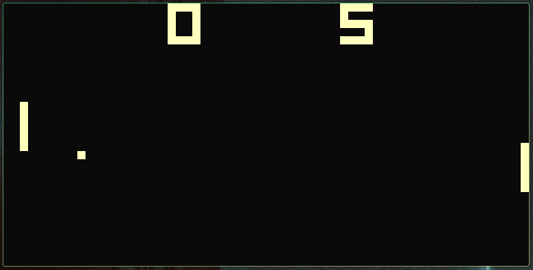

# chip8

A chip8 interpreter using sdl3 for graphics, input and audio.



## Build

Compile the project with cargo:
```sh
cargo build
```

## Usage

Run the compiled executable with any chip8 rom:
```sh
chip8 path/to/rom.ch8
```

The interpreter understands the following environment variables:

| Name | Behavior |
| --- | --- |
| `CHIP8_GRID` | if defined, draws a pixel grid. |
| `CHIP8_FPS` | if defined, draws a framerate counter. |
| `CHIP8_COSMAC_QUIRKS` | if defined, emulates the COSMAC VIP chip8 interpreter behavior  (see [quirks test](https://github.com/Timendus/chip8-test-suite?tab=readme-ov-file#quirks-test)). |
